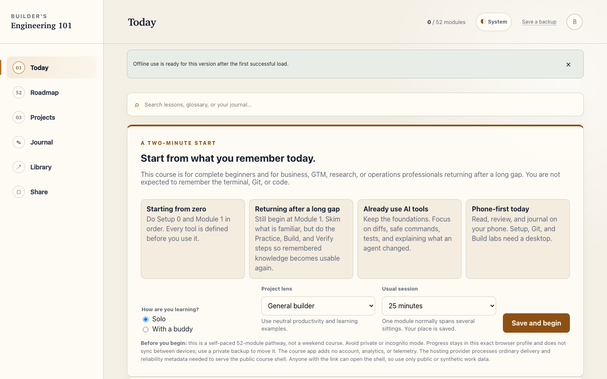
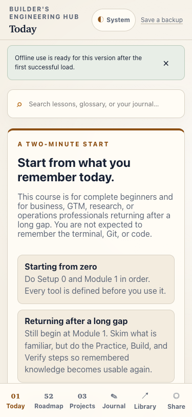
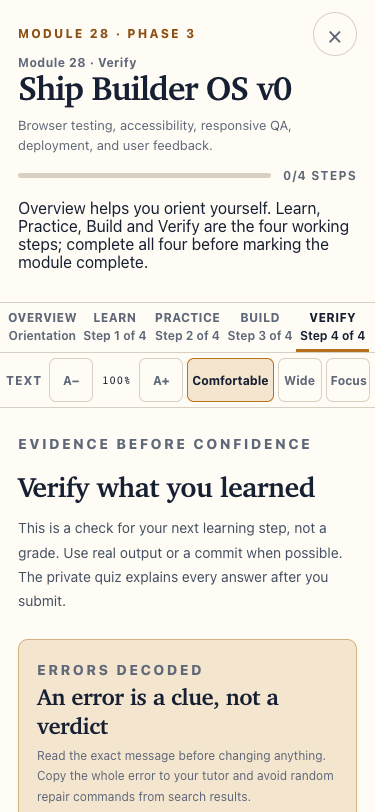

# Builder's Engineering Hub

> A beginner-first, local-first learning product for business and GTM professionals rebuilding engineering fluency.

**Current status:** Small friend pilot

**Public surface:** This repository is a product case study. The application source, curriculum and learner data are not published here.

[View the public case study](https://nikhiljoisr.github.io/builders-engineering-hub-showcase/)

## Why I built it

Many capable business, GTM, research and operations professionals want to build with software again, but most technical material assumes they remember the terminal, Git or code. Builder's Engineering Hub starts below that assumption.

The product turns a 52-module, six-phase curriculum into a calm path from forgotten basics to independently building and reviewing software. It teaches concepts before commands, connects phone-friendly reading with real desktop work, and treats evidence—not confidence—as the completion boundary.

## What the product does

- Moves through **Learn → Practise → Build → Verify** in every module.
- Defines tools and terms before asking a complete beginner to use them.
- Combines browser rehearsals with real terminal, editor and Git work.
- Teaches learners to direct AI coding agents and inspect their work safely.
- Stores progress, journals and evidence in the learner's own browser.
- Works offline after the initial load without accounts or a backend.
- Avoids streaks, points and public scores in favour of mastery at a humane pace.

## Product facts

| Area | Current implementation |
|---|---|
| Curriculum | 52 modules across six phases |
| Delivery | Static React and Vite single-page application |
| Privacy | Progress remains in the learner's browser |
| Accounts and backend | None |
| Analytics or telemetry | None |
| Offline use | Available after the initial load |
| Automated verification | 110 tests |
| Production browser QA | 28 scenarios |
| Mobile coverage | 260 module-and-tab states at 375px |

These figures describe the current verified release; they are engineering evidence, not external certification.

## Who it is for

- Business, GTM and operations professionals returning after a long technical gap.
- Complete beginners who need definitions before commands.
- AI-tool users who want enough engineering judgement to supervise agents responsibly.
- Learners who prefer private, self-paced study without performance theatre.

## My role

I directed and shipped the implementation with AI coding agents, while owning the product direction, learner research, curriculum architecture, acceptance criteria, privacy and accessibility decisions, QA standards and release decisions. Each release is tested against explicit learner and engineering criteria.

## Technical approach

- Static React and Vite application hosted through Cloudflare Pages.
- Browser-local state with validation, migration, merge and backup controls.
- Offline-capable service worker with an explicit update path.
- Hash-based deep links compatible with static hosting.
- Sandboxed, client-side practice environments.
- Restrictive security headers and protected preview deployments.
- No server-side datastore, account system or third-party tracking.

See [Architecture](docs/ARCHITECTURE.md), [Quality and testing](docs/QUALITY-AND-TESTING.md), [Privacy](docs/PRIVACY.md) and [Product decisions](docs/PRODUCT-DECISIONS.md).

## Quality and safety

Release decisions are evidence-led. The current production release is covered by 110 automated tests, 28 browser scenarios and 260 mobile module-and-tab checks. Verification also covers state compatibility, offline behaviour, keyboard use, responsive layouts, security headers and preview-deployment containment.

## What shipping it taught me

- Translate non-technical learner frustration into testable product requirements.
- Extend a mature application without wiping existing learner state.
- Put privacy and accessibility into acceptance criteria rather than a polish list.
- Supervise AI-generated implementation through diffs, tests and release gates.
- Understand how static hosting, service workers, browser storage and deployment previews interact in production.

## Product access

The live course is being tested with a small group of invited learners. Access is shared directly during the pilot. This public repository demonstrates the shipped product without publishing the private application source or curriculum.

## Public boundary

This repository contains original showcase copy, selected screenshots and high-level engineering documentation only. It contains no learner backups, journals, evidence, private URLs, production source or third-party course material. Builder's Engineering Hub is an independent project and is not affiliated with or endorsed by any external learning provider.

Copyright © 2026 Nikhil Jois. All rights reserved. See [NOTICE.md](NOTICE.md).
